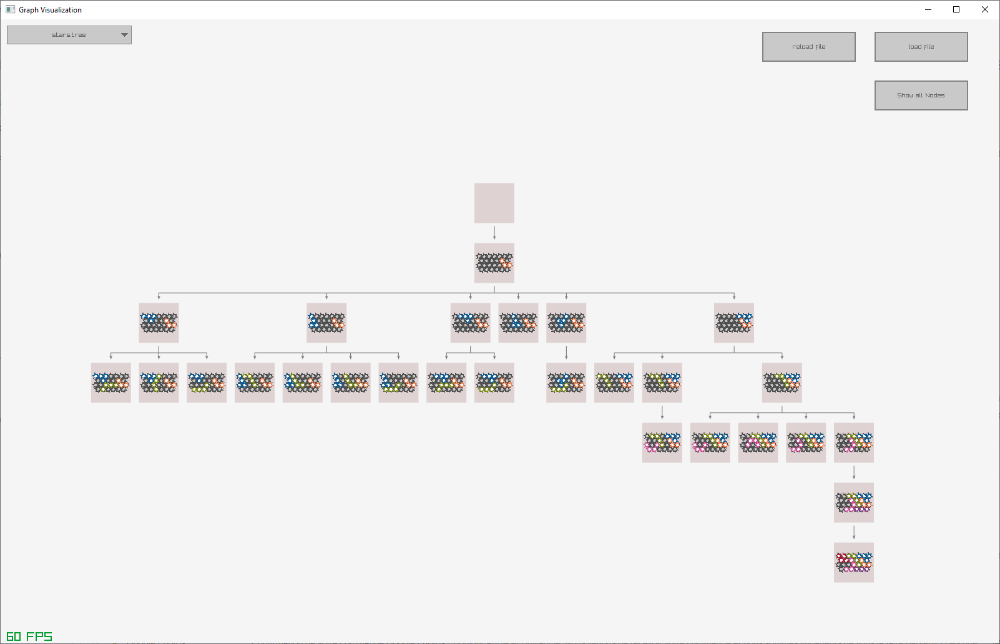
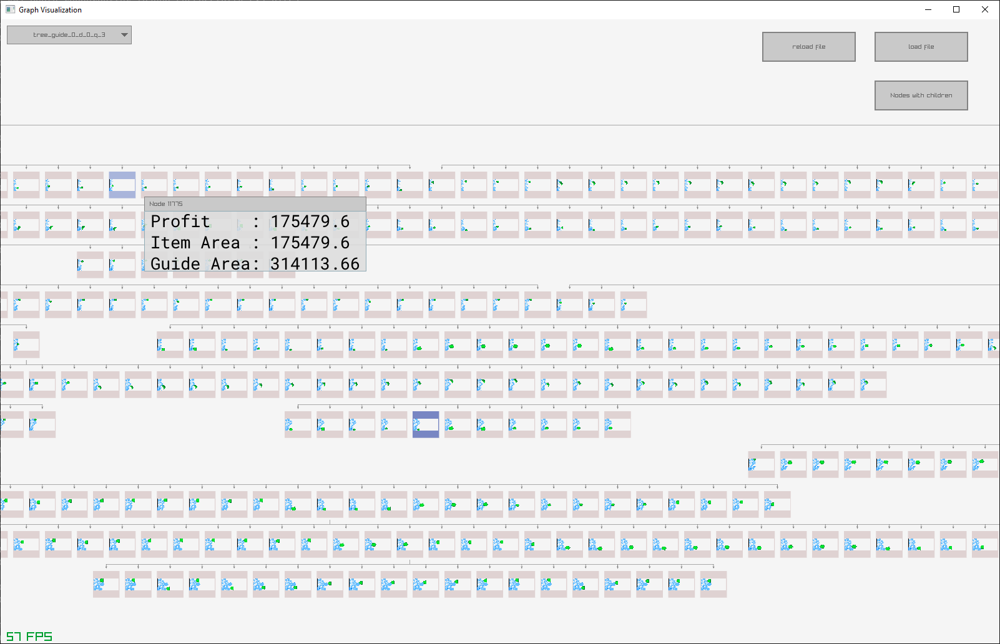

# Optim View

Vizualisation of trees with a focus on search trees for optimization/decision algorithms.
The input is a json file where nodes are defined as a set of polygons.

The final aim is to give some clarity regarding the way branching algorithms solve problems. As
there is no tool that does that whereas it is useful to be able to quickly analyse obvious
mistakes/bugs, it looks like a good idea to implement it myself for my own usage.

It is also a fun exercise to learn technologies I am not familiar with, like ECS libraries, Game
engines etc.


> [!NOTE]
> This is a work-in-progress, use this at your own risk! Anything can change in subsequent
> versions.

Things I am using without extensive knowledge:
- [Raylib](https://www.raylib.com/) (or any game engine), brought to the Go language [here](https://github.com/gen2brain/raylib-go)
- [Ark](https://github.com/mlange-42/ark), an ECS library

# How to use

Load a json file corresponding to the tree or trees you want to analyze.

Keys:
- mouse left click: move around or select a node
- arrows or h/j/k/l/: change the selected node: parent, sibling or child
- esc: quit

## Captures:

This is a capture from a branching algorithm that solves a puzzle game. Root node is the start, and
then every child in the search tree is a decision.



This is a capture from [Florian's packing solver](https://github.com/fontanf/packingsolver)
resolution for a packing of irregular shapes.




# How to run

Need go 1.23.

I develop this tool using wsl and cross-compiling for windows, setting it up by yourself could be a
little painful.

## For wsl

The script used here cross-compile the code, then puts the binary in a Windows folder. See
[devbox.json](./devbox.json) for more details.

```bash
just run

# Or
devbox run build
devbox run run
```
## For linux

Run

```bash
CGO_ENABLED=1 go build -ldflags '-s -w' . # the first build is long since it compiles some C libraries
./optimview
```

